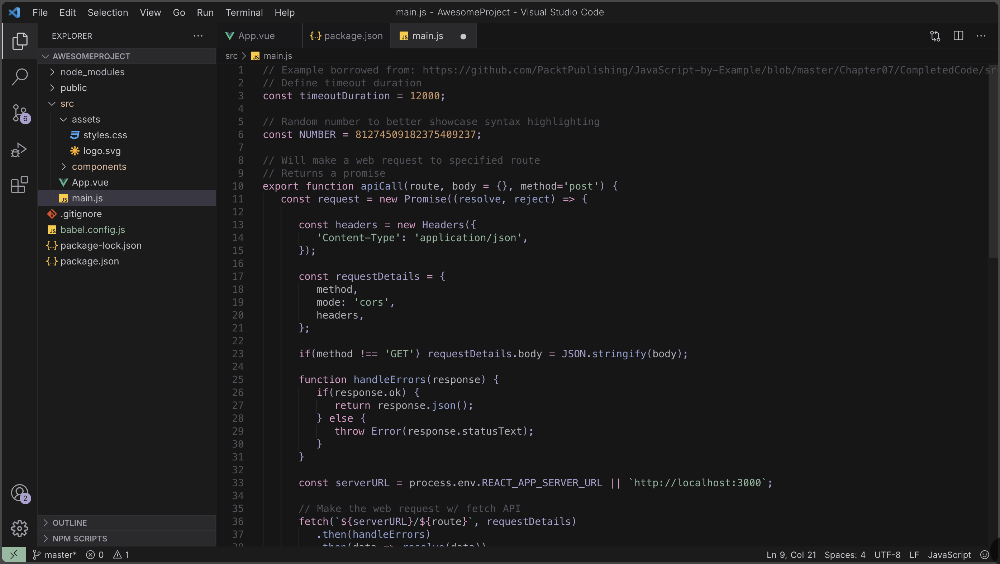
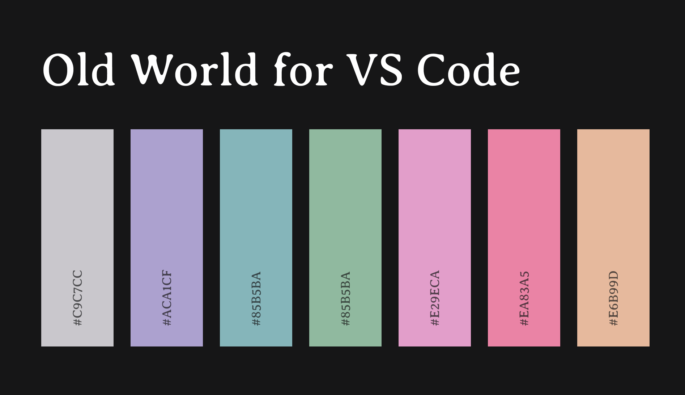

# Old World theme for VSCode

A dark theme for Visual Studio Code inspired by vintage aesthetics and modern code readability.

  

## Description

Old World Theme provides a sophisticated dark color scheme designed to reduce eye strain while maintaining excellent syntax highlighting across multiple programming languages. The theme features a carefully curated palette that balances contrast and readability.

This theme is inspired from [oldworld.nvim](https://github.com/dgox16/oldworld.nvim).

## Features

- **Dark Theme**: Optimized for low-light environments
- **Semantic Highlighting**: Enhanced syntax highlighting for better code understanding
- **Multi-Language Support**: Comprehensive token colors for JavaScript, TypeScript, Python, Rust, Go, and more
- **Careful Color Palette**: Muted yet vibrant colors that don't overwhelm
- **UI Consistency**: Matches VSCode's dark UI theme seamlessly

## Installation

### From VSCode Marketplace

1. Open VSCode
2. Go to Extensions (Ctrl+Shift+X / Cmd+Shift+X)
3. Search for "Old World Theme" or [click here](https://marketplace.visualstudio.com/items?itemName=ReezPatel.oldworlddark)
4. Click Install

### Manual Installation

1. Download the `.vsix` file from the releases
2. In VSCode, go to Extensions
3. Click the "..." menu and select "Install from VSIX"
4. Select the downloaded file

## Usage

After installation:

1. Open VSCode settings (Ctrl+, / Cmd+,)
2. Go to Color Theme
3. Select "Old World Dark" from the list

## Color Palette

  

## Supported Languages

The theme includes optimized syntax highlighting for:

- JavaScript/TypeScript
- Python
- Rust
- Go
- C/C++
- Java
- PHP
- HTML/CSS/SCSS
- JSON/YAML
- Markdown
- And many more...

## Contributing

Contributions are welcome! Please feel free to submit issues and enhancement requests.

## License

This project is licensed under the MIT License.

## Publisher

Published by [Reez](https://github.com/reezpatel)

---

**Enjoy coding with Old World!**
